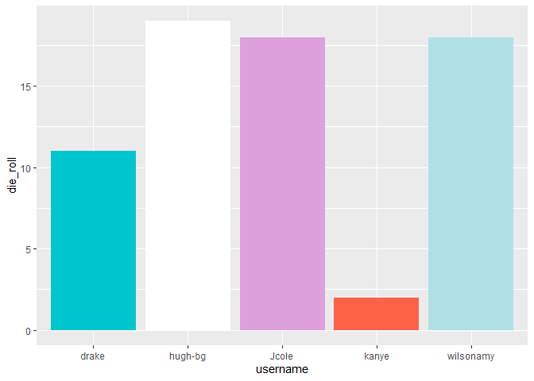

Lab 00 - Hello IDS!
================
INSERT TEAM NAME HERE
2022-09-23

### Load packages and data

``` r
library(tidyverse) 
```

### Exercises 13–17

We set up the data frame.

``` r
usernames <- c("wilsonamy", "hugh-bg", "drake", "kanye", "Jcole") #Extend if necessary
nums <- c(18, 19, 11, 2, 18) #Extend if necessary
colours <- c("powderblue", "white", "turquoise3", "tomato", "plum") #Extend if necessary
hobbies <- c("Hiking", "Hockey", "Piano", "Cement mixing", "Bricklaying") #Extend if necessary

team_data <- tibble(username = usernames, die_roll = nums, colour = colours,
                    hobby = hobbies)
```

### Exercise 18

We now work on visualising our data.

``` r
# Uncomment the three lines below
 p1 <- ggplot(team_data, aes(x = username, y = die_roll)) +
   geom_col(fill = team_data$colour)
 p1
```

<!-- -->

### Exercise 19

The value of dice roll from each team member on a bar graph.

### Exercises 20–21

``` r
# Uncomment the three lines below
 p1 +
  labs(x = "Rapper", y = "Dice Game",
        title = "Rap Game Dice Rolling Championship")
```

<!-- -->

*Remove this text (including the stars), and add your answer for
Exercise 21 here.*

### Exercise 22

``` r
p2 <- ggplot(team_data, aes(x = hobby)) +
  geom_bar()
p2
```

<!-- -->

This graph is not helpful as everyone has different hobbies so the graph
doesn’t show any trends or useful data, would be better presented as a
table.
